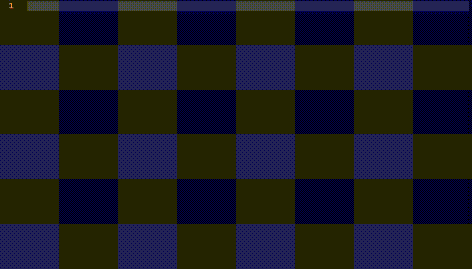

# blink-cmp-wiki-links

A [blink.cmp](https://github.com/Saghen/blink.cmp) completion source that provides fuzzy matching for markdown file names and existing wiki links, automatically formatting them as wiki links (`[[filename]]`).



## ✨ Features

- **Always-on completion**: No need to type `[[` - completions appear as you type
- **Fuzzy matching**: Powered by blink.cmp's performance-optimized fuzzy matcher
- **Auto wiki-link formatting**: Accepted completions become `[[filename]]`
- **Dual search backends**: Combines file discovery (`fd`) with existing wiki link search (`rg`)
- **Smart deduplication**: File results take priority over existing wiki links when duplicates exist
- **Smart workspace detection**: Automatically finds your notes workspace
- **Performance optimized**: Uses `fd` for fast file discovery and `rg` for existing link detection
- **Configurable**: Customize filetypes, exclusions, and workspace detection
- **Contextual file preview**: Shows file content preview starting from the relevant line
- **Minimum prefix length**: Configurable minimum characters before search starts

## 📦 Installation
### 📝 Requirements

- Neovim 0.9+
- [blink.cmp](https://github.com/Saghen/blink.cmp)
- [`fd`](https://github.com/sharkdp/fd): For fast file discovery
- [`rg`](https://github.com/BurntSushi/ripgrep): For searching existing wiki links in files

### Using [lazy.nvim](https://github.com/folke/lazy.nvim)

```lua
{
  "saghen/blink.cmp",
  dependencies = { "l-lin/blink-cmp-wiki-links" },
  opts = {
    sources = {
      default = { "lsp", "path", "snippets", "buffer", "wiki_links" },
      providers = {
        wiki_links = {
          name = "WikiLinks",
          module = "blink-cmp-wiki-links",
          score_offset = 85, -- High priority for wiki links
        },
      },
    },
  },
}
```

### Using other plugin managers

1. Install the plugin using your preferred method
2. Add the `wiki_links` provider to your `blink.cmp` configuration

## ⚙️ Configuration

The configuration of blink-cmp-wiki-links needs to be embedded into the
configuration for blink:

```lua
{
  "saghen/blink.cmp",
  dependencies = {
    "l-lin/blink-cmp-wiki-links",
  },
  opts = {
    sources = {
      default = { "lsp", "path", "snippets", "buffer", "wiki_links" },
      providers = {
        wiki_links = {
          name = "WikiLinks",
          module = "blink-cmp-wiki-links",
          opts = {
            -- Enable for additional file types
            filetypes = { "markdown", "md", "txt" },
            -- More exclusions
            exclude_paths = { ".git", ".obsidian", "assets", "images", ".trash" },
            -- Specifies how to find the root of the project where the fd
            -- search will start from. Accepts the same options as the marker
            -- given to `:h vim.fs.root()` which offers many possibilities for
            -- configuration. If none can be found, defaults to Neovim's cwd.
            --
            -- Examples:
            -- - ".git" (default)
            -- - { ".git", "package.json", ".root" }
            project_root_marker = ".git",
            -- Require more characters before searching
            prefix_min_len = 3,
            -- Show more lines in preview
            preview_line_length = 20,
            -- Custom icon for the completion item kind
            kind_icon = "",
            fd_opts = {
              -- Additional options to pass to the fd command
              additional_fd_options = {},
            },
            rg_opts = {
              -- The maximum file size of a file that ripgrep should include in
              -- its search. Useful when your project contains large files that
              -- might cause performance issues.
              -- Examples:
              -- "1024" (bytes by default), "200K", "1M", "1G", which will
              -- exclude files larger than that size.
              max_filesize = "1M",
              -- The casing to use for the search in a format that ripgrep accepts.
              search_casing = "--ignore-case",
              -- Additional options to pass to the rg command
              additional_rg_options = {},
            },
          },
          score_offset = 85,
        },
      },
    },
  },
}
```

## 🚀 Usage

1. Open any file with a supported filetype (markdown, md by default)
2. Start typing a filename (minimum 3 characters by default)
3. See completions from two sources:
   - **Files**: Matching filenames from your workspace (higher priority)
   - **Existing links**: Wiki links already used in your project files
4. Select from the fuzzy-matched completions
5. The selected item becomes `[[filename]]` automatically
6. Hover over completions to see contextual file content preview:
   - **Files**: Preview starts from line 1
   - **Existing links**: Preview starts from the line where the link was found

## ⚡ Performance

- **Dual-backend architecture**: Combines `fd` for file discovery and `rg` for existing link search
- **Concurrent execution**: Both backends run simultaneously for optimal performance
- **Smart deduplication**: Files take priority over existing links to avoid duplicates
- **Prefix filtering**: Only searches when minimum prefix length is met
- **Lazy preview loading**: File content loaded only when needed for documentation
- **Efficient exclusions**: Directory exclusions applied during both `fd` and `rg` scanning
- **Contextual previews**: Uses `sed` to efficiently extract specific line ranges for preview

## 📄 License

MIT License - see LICENSE file for details.

## 👏 Acknowledgements

- [obsidian-various-complements-plugin](https://github.com/tadashi-aikawa/obsidian-various-complements-plugin) for its ingenious feature of automatically adding wiki links, allowing writers to easily link files without having to remember if a file with that name already exists, and enabling them to maintain their writing flow.
- [blink-ripgrep](https://github.com/mikavilpas/blink-ripgrep.nvim) served as inspiration for this codebase.
